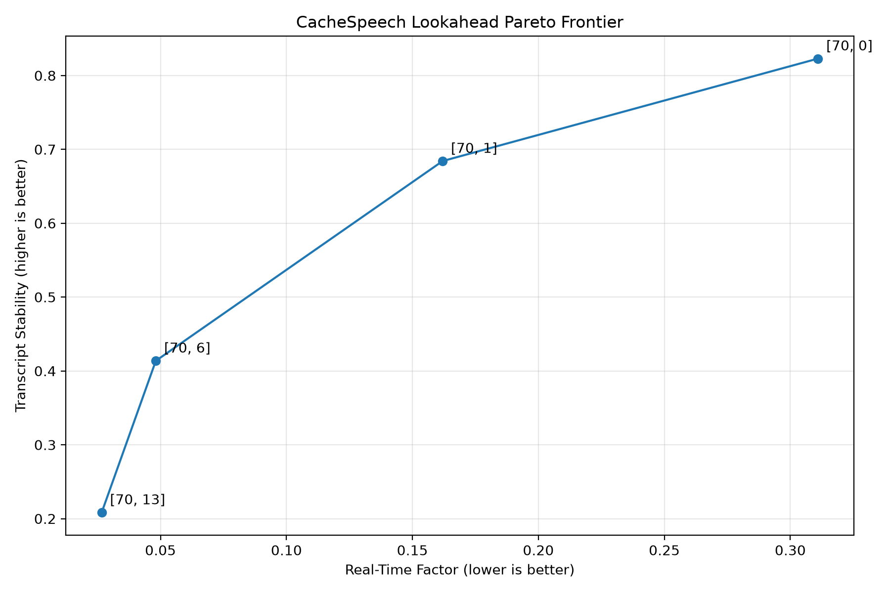

# CacheSpeech

> An empirical study of cache-aware streaming inference for FastConformer ASR.

CacheSpeech investigates how much redundant computation can be eliminated in streaming automatic speech recognition (ASR) by reusing encoder state across streaming chunks.

The project compares:

- **Cache-aware streaming** — encoder state is carried between chunks.
- **Repeated-prefix streaming** — the entire observed audio prefix is re-encoded at every update.

The underlying ASR model is NVIDIA NeMo's
`stt_en_fastconformer_hybrid_large_streaming_multi`.

The goal is to measure not only **runtime speedup**, but also the amount of **redundant encoder computation actually eliminated**.

---

## Research Question

> **How much computation does encoder caching eliminate in streaming ASR, and how much of that reduction translates into real-world inference speedup?**

This distinction matters because reducing neural-network computation does not necessarily produce proportional wall-clock improvements due to decoder, memory, synchronization, and framework overhead.

---

## How It Works

### Cache-aware

The encoder maintains its streaming state between chunks:

```text
chunk₁ ──► Encoder ──► output₁ + cache₁
                         │
chunk₂ ──► Encoder ◄────┘
                         │
                         └──► output₂ + cache₂
```

Previously computed encoder state is reused rather than recomputed.

### Repeated-prefix baseline

The baseline intentionally discards encoder state and processes the entire observed prefix again:

```text
audio[0:t₁] ──► Encoder
audio[0:t₂] ──► Encoder
audio[0:t₃] ──► Encoder
...
```

This provides a controlled baseline for measuring redundant computation.

---

## Experimental Setup

### Model
`stt_en_fastconformer_hybrid_large_streaming_multi`

### Lookahead Configurations
- `[70, 13]`
- `[70,  6]`
- `[70,  1]`
- `[70,  0]`

### Metrics

| Metric | Meaning |
|--------|---------|
| **WER** | Recognition accuracy |
| **RTF** | Inference time / audio duration |
| **Speedup** | No-cache time / cache time |
| **Input reduction** | Reduction in cumulative input frames |
| **Encoded reduction** | Reduction in cumulative encoder output frames |
| **Stability** | Consistency of streaming transcripts |

The benchmark uses CUDA-aware timing with warm-up runs before measurement.

---

## Results

The benchmark outputs detailed multi-audio evaluations (see `experiments/benchmark_dataset.csv`), but the most important findings are:

> **75–98% encoded-frame reduction**
> **1.07–1.25× public-benchmark speedup**
> **0.0 WER on most evaluated configurations**



### Lookahead / Stability Trade-off

Lower lookahead produces more frequent streaming updates and therefore creates substantially more redundant computation in the repeated-prefix baseline.

At zero lookahead, the cache-aware implementation eliminates approximately 95% of cumulative input processing and 98% of cumulative encoded frames in the evaluated workloads.

### Key Findings

**1. Caching eliminates substantial redundant computation**

Across the public benchmark, cache-aware streaming reduces cumulative encoder computation by approximately:

**75–98%**

depending on lookahead.

**2. The benefit increases at lower lookahead**

As streaming becomes more aggressive and updates become more frequent, repeated-prefix inference becomes increasingly wasteful.

This makes state reuse particularly valuable for low-latency streaming.

**3. Compute reduction ≠ runtime speedup**

Despite eliminating up to ~98% of cumulative encoded frames, measured wall-clock speedups are more modest:

**1.07×–1.25× on the public benchmark.**

This suggests that remaining runtime is increasingly dominated by costs outside the redundant encoder computation. That gap is an important systems result in itself.

---

## Reproduce

Install dependencies:

```bash
python -m venv .venv
source .venv/bin/activate
pip install -e .
```

Run the lookahead evaluation:
```bash
PYTHONPATH=src .venv/bin/python experiments/evaluate_baselines.py
```

Run cache vs. no-cache:
```bash
PYTHONPATH=src .venv/bin/python experiments/compare_cache.py
```

Run the dataset benchmark:
```bash
PYTHONPATH=src .venv/bin/python experiments/benchmark_dataset.py
```

Results are written to:
- `experiments/benchmark_dataset.json`
- `experiments/benchmark_dataset.csv`

---

## Limitations & Future Work

The current benchmark is intentionally small and focuses on understanding the computational behavior of cache-aware streaming.

Future experiments include:
- Evaluation on larger public ASR datasets
- Longer utterances
- Multi-stream GPU scaling
- GPU kernel profiling
- Cache memory analysis
- p50/p95/p99 streaming latency
- Encoder vs. decoder runtime breakdown

The most important next question is whether the large reduction in redundant encoder computation translates into larger gains under longer utterances and concurrent streams.

---

## Background

CacheSpeech builds on the cache-aware streaming approach introduced for Conformer/FastConformer ASR by NVIDIA.
- Stateful Conformer with Cache-based Inference for Streaming ASR — ICASSP 2024
- NVIDIA NeMo ASR Documentation

This repository focuses on the empirical systems evaluation of that approach: quantifying redundant computation, runtime impact, and the trade-off between lookahead and streaming behavior.
